# How to Use PlantUML Online Server for Use Case Diagram

## Step-by-Step Instructions

### Step 1: Open PlantUML Online Server
1. Go to: **https://www.plantuml.com/plantuml/uml/**
2. You'll see a text editor on the left and a preview on the right

### Step 2: Copy the Code
1. Open the file: `USE_CASE_DIAGRAM_ONLINE.puml`
2. Select all the code (Ctrl+A or Cmd+A)
3. Copy it (Ctrl+C or Cmd+C)

### Step 3: Paste and Render
1. Go back to the PlantUML online server
2. Clear any existing code in the editor
3. Paste your code (Ctrl+V or Cmd+V)
4. The diagram will automatically render on the right side

### Step 4: Export the Diagram
1. **Right-click** on the rendered diagram
2. Select **"Save image as..."** or **"Copy image"**
3. Choose format:
   - **PNG** - Best for reports (high quality)
   - **SVG** - Best for web (scalable)
   - **PDF** - Best for documents

## Alternative: Direct URL Method

You can also use the encoded URL method:

1. Copy the code from `USE_CASE_DIAGRAM_ONLINE.puml`
2. Go to: **https://www.plantuml.com/plantuml/uml/SyfFKj2rKt3CoKnELR1Io4ZDoSa70000**
3. Replace the encoded part with your diagram code
4. Or use the online encoder: **https://www.plantuml.com/plantuml/uml/**

## Quick Copy-Paste Code

Here's the complete code ready to paste:

```plantuml
@startuml TravelEase_UseCase_Diagram

title TravelEase System - Use Case Diagram

skinparam actorStyle awesome
skinparam handwritten false
skinparam shadowing true

skinparam actor {
  BackgroundColor #E1F5FF
  BorderColor #0066CC
}

skinparam usecase {
  BackgroundColor #FFF4E6
  BorderColor #FF8C00
}

skinparam package {
  BackgroundColor #F0F0F0
  BorderColor #666666
}

left to right direction

' Actors
actor "Regular User" as User
actor "Travel Agency" as Agency
actor "Administrator" as Admin

' System Boundary
rectangle "TravelEase System" {
  
  ' Authentication Use Cases
  package "Authentication" {
    usecase "Register Account" as UC1
    usecase "Login" as UC2
    usecase "Logout" as UC3
    usecase "Reset Password" as UC4
    usecase "Email Verification" as UC5
  }
  
  ' User Use Cases
  package "User Features" {
    usecase "Browse Travel Packages" as UC6
    usecase "Search Packages" as UC7
    usecase "Filter Packages" as UC8
    usecase "View Package Details" as UC9
    usecase "View Package Itinerary" as UC10
    usecase "View Route Map" as UC11
    usecase "Book Travel Package" as UC12
    usecase "Make Payment" as UC13
    usecase "View Booking History" as UC14
    usecase "Cancel Booking" as UC15
    usecase "Add to Wishlist" as UC16
    usecase "View Wishlist" as UC17
    usecase "Remove from Wishlist" as UC18
    usecase "Manage Profile" as UC19
    usecase "View Booking Confirmation" as UC20
    usecase "Download Booking PDF" as UC21
  }
  
  ' Agency Use Cases
  package "Agency Features" {
    usecase "Register as Agency" as UC22
    usecase "Create Travel Package" as UC23
    usecase "Edit Package" as UC24
    usecase "Delete Package" as UC25
    usecase "View Own Packages" as UC26
    usecase "Set Package Pricing" as UC27
    usecase "Add Accommodations" as UC28
    usecase "Add Restaurants" as UC29
    usecase "Add Transportation" as UC30
    usecase "Create Itinerary" as UC31
    usecase "View Package Bookings" as UC32
    usecase "Manage Agency Profile" as UC33
    usecase "Upload License Documents" as UC34
  }
  
  ' Admin Use Cases
  package "Admin Features" {
    usecase "Approve Agency Registration" as UC35
    usecase "Reject Agency Registration" as UC36
    usecase "View All Agencies" as UC37
    usecase "Approve Travel Package" as UC38
    usecase "Reject Travel Package" as UC39
    usecase "View All Packages" as UC40
    usecase "Manage Users" as UC41
    usecase "View System Statistics" as UC42
    usecase "Manage Agency Status" as UC43
    usecase "View Booking Reports" as UC44
  }
}

' User Relationships
User --> UC1
User --> UC2
User --> UC3
User --> UC4
User --> UC6
User --> UC7
User --> UC8
User --> UC9
User --> UC12
User --> UC14
User --> UC15
User --> UC16
User --> UC17
User --> UC18
User --> UC19

' Agency Relationships
Agency --> UC1
Agency --> UC2
Agency --> UC3
Agency --> UC4
Agency --> UC22
Agency --> UC23
Agency --> UC24
Agency --> UC25
Agency --> UC26
Agency --> UC32
Agency --> UC33
Agency --> UC34

' Admin Relationships
Admin --> UC2
Admin --> UC3
Admin --> UC35
Admin --> UC36
Admin --> UC37
Admin --> UC38
Admin --> UC39
Admin --> UC40
Admin --> UC41
Admin --> UC42
Admin --> UC43
Admin --> UC44

' Include Relationships (dotted arrow)
UC1 .> UC5 : <<include>>
UC12 .> UC13 : <<include>>
UC23 .> UC27 : <<include>>
UC23 .> UC28 : <<include>>
UC23 .> UC29 : <<include>>
UC23 .> UC30 : <<include>>
UC23 .> UC31 : <<include>>

' Extend Relationships (dotted arrow)
UC9 .> UC10 : <<extend>>
UC9 .> UC11 : <<extend>>
UC12 .> UC20 : <<extend>>
UC20 .> UC21 : <<extend>>

note right of UC1
  Registration includes
  Email Verification
end note

note right of UC12
  Booking includes Payment
  and extends to Confirmation
end note

note right of UC23
  Creating package includes:
  Pricing, Accommodations,
  Restaurants, Transportation,
  and Itinerary
end note

@enduml
```

## Tips for Best Results

1. **Wait for Rendering**: The diagram may take a few seconds to render, especially with many use cases
2. **Zoom In/Out**: Use browser zoom (Ctrl/Cmd + Mouse Wheel) to adjust size
3. **Full Screen**: Click on the diagram to view in full screen
4. **High Resolution**: For reports, export as PNG at maximum quality
5. **Edit Online**: You can edit the code directly in the online editor to make changes

## Troubleshooting

### Diagram Not Showing
- Check for syntax errors (missing quotes, brackets)
- Make sure `@startuml` and `@enduml` are present
- Try refreshing the page

### Diagram Too Large
- Use the simplified version: `USE_CASE_DIAGRAM_SIMPLE.puml`
- Remove some use cases if needed
- Adjust the layout direction

### Colors Not Showing
- Some browsers may not render all colors
- Try a different browser (Chrome, Firefox, Edge)
- The diagram will still work without colors

## Reference

- PlantUML Use Case Diagram Documentation: https://plantuml.com/use-case-diagram
- Online Server: https://www.plantuml.com/plantuml/uml/

