# TravelEase System - Use Case Diagram

## Mermaid Format (Alternative)

```mermaid
graph TB
    subgraph "TravelEase System"
        subgraph "Authentication"
            UC1[Register Account]
            UC2[Login]
            UC3[Logout]
            UC4[Reset Password]
            UC5[Email Verification]
        end
        
        subgraph "User Features"
            UC6[Browse Travel Packages]
            UC7[Search Packages]
            UC8[Filter Packages]
            UC9[View Package Details]
            UC10[View Package Itinerary]
            UC11[View Route Map]
            UC12[Book Travel Package]
            UC13[Make Payment]
            UC14[View Booking History]
            UC15[Cancel Booking]
            UC16[Add to Wishlist]
            UC17[View Wishlist]
            UC18[Remove from Wishlist]
            UC19[Manage Profile]
            UC20[View Booking Confirmation]
            UC21[Download Booking PDF]
        end
        
        subgraph "Agency Features"
            UC22[Register as Agency]
            UC23[Create Travel Package]
            UC24[Edit Package]
            UC25[Delete Package]
            UC26[View Own Packages]
            UC27[Set Package Pricing]
            UC28[Add Accommodations]
            UC29[Add Restaurants]
            UC30[Add Transportation]
            UC31[Create Itinerary]
            UC32[View Package Bookings]
            UC33[Manage Agency Profile]
            UC34[Upload License Documents]
        end
        
        subgraph "Admin Features"
            UC35[Approve Agency Registration]
            UC36[Reject Agency Registration]
            UC37[View All Agencies]
            UC38[Approve Travel Package]
            UC39[Reject Travel Package]
            UC40[View All Packages]
            UC41[Manage Users]
            UC42[View System Statistics]
            UC43[Manage Agency Status]
            UC44[View Booking Reports]
        end
    end
    
    User((Regular User)) --> UC1
    User --> UC2
    User --> UC3
    User --> UC4
    User --> UC5
    User --> UC6
    User --> UC7
    User --> UC8
    User --> UC9
    User --> UC10
    User --> UC11
    User --> UC12
    User --> UC13
    User --> UC14
    User --> UC15
    User --> UC16
    User --> UC17
    User --> UC18
    User --> UC19
    User --> UC20
    User --> UC21
    
    Agency((Travel Agency)) --> UC1
    Agency --> UC2
    Agency --> UC3
    Agency --> UC4
    Agency --> UC5
    Agency --> UC22
    Agency --> UC23
    Agency --> UC24
    Agency --> UC25
    Agency --> UC26
    Agency --> UC27
    Agency --> UC28
    Agency --> UC29
    Agency --> UC30
    Agency --> UC31
    Agency --> UC32
    Agency --> UC33
    Agency --> UC34
    
    Admin((Administrator)) --> UC2
    Admin --> UC3
    Admin --> UC35
    Admin --> UC36
    Admin --> UC37
    Admin --> UC38
    Admin --> UC39
    Admin --> UC40
    Admin --> UC41
    Admin --> UC42
    Admin --> UC43
    Admin --> UC44
    
    UC1 -.->|includes| UC5
    UC12 -.->|includes| UC13
    UC23 -.->|includes| UC27
    UC23 -.->|includes| UC28
    UC23 -.->|includes| UC29
    UC23 -.->|includes| UC30
    UC23 -.->|includes| UC31
    UC9 -.->|extends| UC10
    UC9 -.->|extends| UC11
    UC12 -.->|extends| UC20
    UC20 -.->|extends| UC21
```

## Use Case Descriptions

### Authentication Use Cases
- **UC1: Register Account** - New users can create an account with email and password
- **UC2: Login** - Authenticated users can log into the system
- **UC3: Logout** - Users can log out from the system
- **UC4: Reset Password** - Users can reset their forgotten password
- **UC5: Email Verification** - Users verify their email address (included in registration)

### User Features
- **UC6: Browse Travel Packages** - Users can view all available travel packages
- **UC7: Search Packages** - Users can search packages by destination, name, or agency
- **UC8: Filter Packages** - Users can filter packages by price, duration, destination, travelers
- **UC9: View Package Details** - Users can view detailed information about a package
- **UC10: View Package Itinerary** - Users can view the day-by-day itinerary (extends UC9)
- **UC11: View Route Map** - Users can view the route map for the package (extends UC9)
- **UC12: Book Travel Package** - Users can book a travel package
- **UC13: Make Payment** - Users make payment for booking (included in UC12)
- **UC14: View Booking History** - Users can view their past and current bookings
- **UC15: Cancel Booking** - Users can cancel their bookings
- **UC16: Add to Wishlist** - Users can save packages to wishlist
- **UC17: View Wishlist** - Users can view their saved packages
- **UC18: Remove from Wishlist** - Users can remove packages from wishlist
- **UC19: Manage Profile** - Users can update their profile information
- **UC20: View Booking Confirmation** - Users can view booking confirmation (extends UC12)
- **UC21: Download Booking PDF** - Users can download booking confirmation as PDF (extends UC20)

### Agency Features
- **UC22: Register as Agency** - Travel agencies can register on the platform
- **UC23: Create Travel Package** - Agencies can create new travel packages
- **UC24: Edit Package** - Agencies can edit their existing packages
- **UC25: Delete Package** - Agencies can delete their packages
- **UC26: View Own Packages** - Agencies can view all their created packages
- **UC27: Set Package Pricing** - Agencies set pricing for packages (included in UC23)
- **UC28: Add Accommodations** - Agencies add hotels/accommodations (included in UC23)
- **UC29: Add Restaurants** - Agencies add restaurants (included in UC23)
- **UC30: Add Transportation** - Agencies add transportation options (included in UC23)
- **UC31: Create Itinerary** - Agencies create day-by-day itinerary (included in UC23)
- **UC32: View Package Bookings** - Agencies can view bookings for their packages
- **UC33: Manage Agency Profile** - Agencies can update their profile information
- **UC34: Upload License Documents** - Agencies can upload business license documents

### Admin Features
- **UC35: Approve Agency Registration** - Admins can approve agency registrations
- **UC36: Reject Agency Registration** - Admins can reject agency registrations
- **UC37: View All Agencies** - Admins can view all registered agencies
- **UC38: Approve Travel Package** - Admins can approve packages created by agencies
- **UC39: Reject Travel Package** - Admins can reject packages created by agencies
- **UC40: View All Packages** - Admins can view all packages in the system
- **UC41: Manage Users** - Admins can manage user accounts
- **UC42: View System Statistics** - Admins can view system-wide statistics
- **UC43: Manage Agency Status** - Admins can change agency approval status
- **UC44: View Booking Reports** - Admins can view booking reports and analytics

